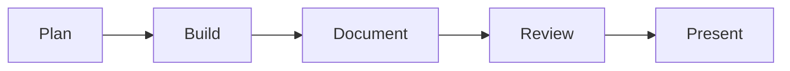

{ width="400px" }
{: style="margin-top:0.5em;margin-bottom:2em"}
# Syllabus

**14-761: Applied Information Assurance**  
_Spring 2023_

## Course Details

|                          |                                                                                                                           |
| ------------------------ | ------------------------------------------------------------------------------------------------------------------------- |
| **Instructors**          | Matt Kaar <[mkaar@cmu.edu](mailto:mkaar@cmu.edu)>  Chris Herr <[cherr2@andrew.cmu.edu](mailto:cherr2@andrew.cmu.edu)> |
| **Teaching Assistant**  | Ankshit Jain <[ankshitj@andrew.cmu.edu](mailto:ankshitj@andrew.cmu.edu)>                                            |
| **Office Hours**         | Zoom&mdash;by appointment                                                                                                 |
| **Units**                | 12                                                                                                                        |
| **Sections**             | A (Pittsburgh), SV (Silicon Valley)                                                                                       |
| **Prerequisites**        | None                                                                                                                      |
| **Class Schedule**       | Tuesdays @ 4:00-6:50pm ET, 1:00-3:50pm PT                                                                                 |
| **Class Location**       | INI DEC (Pittsburgh), B23 212 (Silicon Valley)                                                                            |
| **Textbook Information** | N/A                                                                                                                       |

## Course Overview

This course focuses on practical applications of Information Assurance (IA) and cybersecurity policies and technologies in enterprise network environments. The course is designed around virtual lab environments and exercise scenarios that provide for robust and realistic hands-on experiences within a broad range of IA topic areas. Students are provided numerous practical opportunities to apply cybersecurity best practices to solve real-world problems. AIA classes include short lectures and in-class hands-on activities. Class participation is required. Zoom and Piazza will facilitate student participation. The TA will serve as moderator during classes.

## Course Objectives

At the end of the course, students should be able to:

-   Define Defense-in Depth as it applies to Information Assurance
-   List and describe nine Foundations of Information Assurance
-   Identify and execute common threats to IT Enterprises
-   List common host security best practices and implement controls
-   List common network security best practices and implement controls
-   Identify common network monitoring best practices, implement same on IT networks, and analyze collected data for anomalous behavior
-   Compare common cryptosystems, implement and evaluate data encryption/integrity approaches on IT systems and networks
-   Recognize and describe technical benefits and challenges encryption has on information assurance and cyber forensics
-   Describe the incident response process and apply process during live and simulated cyber security events
-   Correctly use common incident response tools to identify, collect and analyze data in search of malicious activities on IT networks
-   Describe the digital forensic process and apply this during live and simulated cyber investigations
-   Correctly use common digital forensics tools to acquire and analyze forensic evidence

## Coursework

### Homework Assignments

Students will complete hands-on labs as homework. These labs are delivered using the TopoMojo platform (<https://topomojo.ini.cmu.edu>), the same environment used to build [Group Projects](#group-project) later in the class. Homework assignments will be made available via Canvas, and students must complete each week's required homework by the following **Monday at 4:00pm ET**. This gives the TA time to grade homework prior to the start of class each week.

### Weekly Quizzes

The instructors will use 10-question quizzes at the beginning of class (weeks 2-10) to evaluate student understanding of the homework assignments and lecture content. To make these assessments more enjoyable for the students, we will use the Kahoot game-based web/mobile application to administer the quizzes. To get credit and enable grading, each student must use their **Andrew ID** for Nicknames for each Kahoot quiz. Five bonus points will be given to students finishing in first place on each quiz. If the winning number of correct answers is the same across both sections (Pittsburgh and Silicon Valley), bonus points will be earned by one student in each section that week. Also, the lowest quiz score will be dropped for each student.

### Team Exercises

The keystone components of AIA are the scenario-based team exercises. To complete these hands-on exercises, students will login to TopoMojo and/or the CyberLEAP virtual environment: (<https://cyberleap.cmu.edu>), depending on the exercise. The TA will brief and debrief students on the objectives, requirements, and solutions for each exercise. Teams will have until the following **Monday at 4:00pm ET** to complete each exercise.

### Group Project

The goal of the project is to provide a meaningful _learning experience_ (new hands-on lab) for future AIA students. By **Week 2** of the course, students must select teammates with whom they will co-develop a group project. These **3-4 person** teams will research, integrate, and document a cybersecurity technology instructional lab.  This will include the configuration of virtual machines and developing step-by-step procedures for completing the security or forensics technology best practice. Teams can select their own lab topics although instructors can help with topic ideas. An instructor checkpoint meeting will take place during **Week 8**. Instructors will meet with each team during class to discuss their progress. Students must demonstrate that they are at least 50% complete with their project according to their project plan submitted on week 4.

#### Project Workflow

1.  **Plan:** Teams must submit a 1-2 page group project proposal no later than the start of class on **Week 4** of the course. An exemplar proposal will be provided.

    -   This proposal should first describe the team's technical topic and problem being addressed. Next, teams must lay out the planned schedule of development, workload breakdown showing each team member's planned tasks/responsibilities, as well as the planned instructional objectives of their hands-on lab project.

2.  **Build:** Teams will build their projects using the TopoMojo lab builder interface. This will significantly ease the overhead required to create/network the VMs (**max 5)**. Your VMs can be bridged to access the Internet during the build phase; however, your final lab must **NOT** require Internet access in its final state. Additionally, teams must **NOT** use the bridge-net IP space (10.9.8.0/24) in their project network.  The TA will demonstrate how to use bridge-net in class.

3.  **Document:** A lab manual must be written clearly and concisely within the TopoMojo Markdown editor. Along with step-by-step instructions, this document must also contain instructive, contextual information that describes why the specific steps are being completed.

    !!! warning "Plagiarism Warning!"

        The lab manual must be the **original work** of the team.  Proper citation of all technical sources is required and can be included in the *References* section of the lab document. If plagiarism is identified in the submitted group project, all students will receive a **ZERO (0)** for the assignment, and an _Academic Integrity Violation Report_ will be submitted to the [CMU Office of Community Standards & Integrity](https://cmu.edu/student-affairs/ocsi/).

        More information can be found in the [AIA Plagiarism Policy](#plagiarism-policy).

    -   At least **5** automated verification scripts must be included in the lab that when run, validate successful completion of the lab's learning objectives. These should assess student understanding (quiz questions) as well as query the state of project VMs to verify that steps are completed correctly. These scripts must also be included as text in appendix 1 at the end of the lab manual.

    -   A second appendix must include the quiz questions and answers included in the scripts.

4.  **Review:** To enhance the quality of the final products and to promote collaboration, group project peer reviews will be conducted.  On **Week 10** of the course, teams will be assigned to test-drive another team's lab and make comments on their documentation, structure, and overall quality. Peer feedback should be compiled into one document no more than 3 pages long. The review document must be sent to the owning team and posted to the group site on Canvas. This must be completed by the start of class on **Week 11**.  This will give the owning team time to consider these comments and incorporate any suggestions/changes into their final project submission.

5.  **Present:** All teams will be given **25-30 minutes** during the last 3 weeks of the course to present their project to the rest of the class. The teams must first present an overview of their lab (3-4 slides) that introduce the topic, learning objectives, and key takeaways. The teams must then interactively walk the class through the steps of their lab within TopoMojo as part of a **live** demonstration. Finally, students in AIA must complete each week's presented projects **as homework** before class starts the following week. Class attendance is **mandatory** during the group project presentations.

#### Project Deliverables

1. Lab manual in the TopoMojo Markdown editor

2. TopoMojo virtual machines and any required ISO images. VMs must be saved in the correct final starting state.

The above deliverables must be ready for grading by the start of class on **Week 12**. The order of the presentations will be selected at random, although teams can volunteer to present first if desired. To ensure all teams are provided the same project delivery timeline, teams will be locked out of their TopoMojo workspaces on week 12.

## Evaluation & Grading

### Late Submissions

Students who miss assignment deadlines will have **24 hours** to submit late work. Late submissions will incur a **10%** deduction. _No points are awarded after the 24-hour grace period._

### Course Grading Summary

| Assignment                                                                             |   Points |
| -------------------------------------------------------------------------------------- | -------: |
| Enterprise Information Security Part 1                                                 |       50 |
| Enterprise Information Security Part 2                                                 |       50 |
| Tactical Response and Analysis Challenge (TRAC) Team Exercise Part 1                   |       50 |
| TRAC Part 2                                                                            |       50 |
| XYZ Bank Team Exercise Part 1                                                          |       60 |
| XYZ Bank Part 2                                                                        |       60 |
| Operation Aurora Capstone Exercise Part 1                                              |       75 |
| Operation Aurora Part 2                                                                |       75 |
| In-Class Kahoot! Quizzes (10 pts x 9 weeks of the course&mdash;drop lowest quiz score) |       80 |
| Homework Assignments (10 pts x 12 weeks of the course)                                 |      120 |
| Group Projects                                                                         |      300 |
| Group Project Attendance                                                               |       30 |
| **TOTAL**                                                                              | **1000** |

### Group Project Rubric

| Graded Item                                                                                                                                                                |  Points |
| -------------------------------------------------------------------------------------------------------------------------------------------------------------------------- | ------: |
| **Lab Functions Properly** _Everything works as expected and the Markdown lab manual makes logical sense and is easy to follow. Stated learning objectives are met._                                       |     120 |
| **Presentation** _Presentation is instructionally sound with key points clearly taught and demonstrated. Demo works as planned without unacceptable errors or delays._ |      80 |
| **Peer Review** _Provided adequate feedback to peers and addressed findings and suggestions for improvement in final project deliverables._                            |      50 |
| **Automated Verification Scripts** _At least five (5) scripts designed to test key learning steps within project and all work as expected._                            |      50 |
| **TOTAL**                                                                                                                                                                  | **300** |

### Letter Grade Cutoffs

| Letter Grade | &GreaterEqual; Percentage |
| ------------ | ------------------------- |
| A            | 90%                       |
| A-           | 88%                       |
| B+           | 86%                       |
| B            | 80%                       |
| B-           | 78%                       |
| C+           | 76%                       |
| C            | 70%                       |
| C-           | 68%                       |
| D+           | 66%                       |
| D            | 60%                       |
| D-           | 58%                       |

## Course Calendar

| Week #              | Date     | Class                                                           | Exercise/Homework                                       |
| ------------------- | -------- | --------------------------------------------------------------- | ------------------------------------------------------- |
| **1** (Kaar, Herr)  | Jan 17   | Course Overview Hacking Lecture                             | **HW1:** TopoMojo Labs                                  |
| **2** (Herr)        | Jan 24    | Data Security                                                   | **HW2:** EIS Prep Labs 1-6                              |
| **3** (Kaar)        | Jan 31   | Host Security                                                   | **HW3:** EIS Prep Labs 7-11                             |
| **4** (Herr)        | Feb 7   | Network Security _Group Project Proposals Due_              | **Exercise:** EIS Exercise Part 1 **HW4:** TopoMojo |
| **5** (Kaar)        | Feb 14   | Monitoring, Detection & Response                                | **Exercise:** EIS Exercise Part 2 **HW5:** TopoMojo |
| **6** (Herr)        | Feb 21    | Cyber Forensics Fundamentals                                   | **Exercise:** TRAC Part 1 **HW6:** TopoMojo         |
| **7** (Kaar)        | Feb 28   | Cyber Forensics Special Topics                                    | **Exercise:** TRAC Part 2 **HW7:** TopoMojo         |
| _SPRING BREAK_        | _Mar 7_ | _No class_                                                      |                                                         |
| **8** (Kaar, Herr)  | Mar 14   | _Group Project Check-in_                                        | **Exercise:** XYZ Bank Part 1 **HW8:** TopoMojo     |
| **9** (Herr)        | Mar 21    | Cloud Security                                                  | **Exercise:** XYZ Bank Part 2 **HW9:** TopoMojo     |
| **10** (Jain) | Mar 28    | TA Lecture&mdash;Topic TBD  _Project Peer Reviews Assigned_ | **Exercise:** Operation Aurora Part 1                   |
| **11**              | Apr 4   | _Project Peer Reviews Due_                                      | **Exercise:** Operation Aurora Part 2                   |
| **12**              | Apr 11   | _Group Projects Due_ Group Project Presentations            | **HW10:** This week's group project labs                |
| **13**              | Apr 18   | Group Project Presentations                                     | **HW11:** Group project labs                            |
| **14**              | Apr 25    | Group Project Presentations Capstone CTF (bonus points)                                     | **HW12:** Group project labs                            |

## Course Policies

### Take Care of Yourself

As a student, you may experience a range of challenges that can interfere with learning, such as strained relationships, increased anxiety, substance use, feeling down, difficulty concentrating and/or lack of motivation. These mental health concerns or stressful events may diminish your academic performance and/or reduce your ability to participate in daily activities. CMU services are available, and treatment does work. You can learn more about confidential mental health services available on campus at: <https://www.cmu.edu/counseling/>.  Support is always available (24/7) from Counseling and Psychological Services: 412-268-2922.

### Statement on Academic Integrity

_[cmu.edu/student-affairs/theword/academic/statement-on-academic-integrity.html](https://cmu.edu/student-affairs/theword/academic/statement-on-academic-integrity.html)_

Carnegie Mellon University educates its students to become professionals who will serve society with integrity. The university also creates and disseminates new knowledge and expressions of knowledge in ways that benefit society. Carnegie Mellon strives to serve the changing needs of society through the three primary goals outlined in its mission statement: to create and disseminate knowledge and art through research and artistic expression, teaching and learning and transfer to society, to serve students by teaching them leadership and problem-solving skills, and the values of quality, ethical behavior, responsibility to society and commitments to work, to pursue the advantages provided by a diverse community, open to the exchange of ideas, where discovery and artistic creativity can flourish.

These statements provide groundwork for academic integrity that includes everyone in the Carnegie Mellon community. Our common objective is to make sure that we teach and learn with commitment, consistency, honesty and fidelity. This process involves at its core interaction between young and old, novice and expert, apprentice and master. Integrity requires that we examine the context in which we do our work. In the university community, young people grow and develop their identities, which mandate that all our dealings follow and foster principles of respect for autonomy, beneficence, justice and fidelity to the mission of the university. The university population is increasingly diverse, faces rapid changes in knowledge and technology that have historically produced uncertainty about the appropriate roles of individuals and professions in the larger society. Each of these facts can and do create issues that we need to be aware of and deal with if we are to successfully achieve our primary missions. When these circumstances are not fully communicated to and understood by all persons in the community, unnecessary suspicions concerning integrity may distract from our teaching and learning and taint the atmosphere on campus. When they are openly discussed and conflicts concerning them openly aired, we all proceed with greater confidence and trust.

All members of the university community have the obligation to serve as models of personal and professional integrity, as well as models for creating, expressing and transferring knowledge. This implies that the faculty not only provide the knowledge and training that prepare students to find their productive roles in society, but also help them discover and maintain integrity in the practice of that role. Staff and administrators are charged with representing the university accurately and forthrightly. Students are responsible for conducting their learning in a similarly honest and committed fashion-by avoiding plagiarism, cheating or taking credit for work not their own-and thus contributing to a campus atmosphere which expects and supports academic integrity.

***This policy applies, in all respects, to this course.***

### Carnegie Mellon Code

_[cmu.edu/student-affairs/theword/code/](https://www.cmu.edu/student-affairs/theword/code/)_

Students at Carnegie Mellon, because they are members of an academic community dedicated to the achievement of excellence, are expected to meet the highest standards of personal, ethical and moral conduct possible.

These standards require personal integrity, a commitment to honesty without compromise, as well as truth without equivocation and a willingness to place the good of the community above the good of the self. Obligations once undertaken must be met, commitments kept.

As members of the Carnegie Mellon community, individuals are expected to uphold the standards of the community in addition to holding others accountable for said standards. It is rare that the life of a student in an academic community can be so private that it will not affect the community as a whole or that the above standards do not apply.

The discovery, advancement and communication of knowledge are not possible without a commitment to these standards. Creativity cannot exist without acknowledgment of the creativity of others. New knowledge cannot be developed without credit for prior knowledge. Without the ability to trust that these principles will be observed, an academic community cannot exist.

The commitment of its faculty, staff and students to these standards contributes to the high respect in which the Carnegie Mellon degree is held. Students must not destroy that respect by their failure to meet these standards. Students who cannot meet them should voluntarily withdraw from the university.

***This policy applies, in all respects, to this course.***

### Cheating Policy

According to the [_University Policy on Academic Integrity_](https://www.cmu.edu/policies/student-and-student-life/academic-integrity.html), cheating "occurs when a student avails her/himself of an unfair or disallowed advantage which includes but is not limited to:

1. Theft of or unauthorized access to an exam, answer key or other graded work from previous course offerings.

2. Use of an alternate, stand-in or proxy during an examination.

3. Copying from the examination or work of another person or source.

4. Submission or use of falsified data.

5. Using false statements to obtain additional time or other accommodation.

6. Falsification of academic credentials."

***This policy applies, in all respects, to this course.***

### Plagiarism Policy

According to the [_University Policy on Academic Integrity_](https://www.cmu.edu/policies/student-and-student-life/academic-integrity.html), plagiarism "is defined as the use of work or concepts contributed by other individuals without proper attribution or citation. Unique ideas or materials taken from another source for either written or oral use must be fully acknowledged in academic work to be graded. Examples of sources expected to be referenced include but are not limited to:

1. Text, either written or spoken, quoted directly or paraphrased.

2. Graphic elements.

3. Passages of music, existing either as sound or as notation.

4. Mathematical proofs.

5. Scientific data.

6. Concepts or material derived from the work, published or unpublished, of another person."

***This policy applies, in all respects, to this course.***

### Unauthorized Assistance Policy

According to the [_University Policy on Academic Integrity_](https://www.cmu.edu/policies/student-and-student-life/academic-integrity.html), unauthorized assistance "refers to the use of sources of support that have not been specifically authorized in this policy statement or by the course instructor(s) in the completion of academic work to be graded.  Such sources of support may include but are not limited to advice or help provided by another individual, published or unpublished written sources, and electronic sources. Examples of unauthorized assistance include but are not limited to:

1. Collaboration on any assignment beyond the standards authorized by this policy statement and the course instructor(s).

2. Submission of work completed or edited in whole or in part by another person.

3. Supplying or communicating unauthorized information or materials, including graded work and answer keys from previous course offerings, in any way to another student.

4. Use of unauthorized information or materials, including graded work and answer keys from previous course offerings.

5. Use of unauthorized devices.

6. Submission for credit of previously completed graded work in a second course without first obtaining permission from the instructor(s) of the second course. In the case of concurrent courses, permission to submit the same work for credit in two courses must be obtained from the instructors of both courses."

***This policy applies, in all respects, to this course.***
